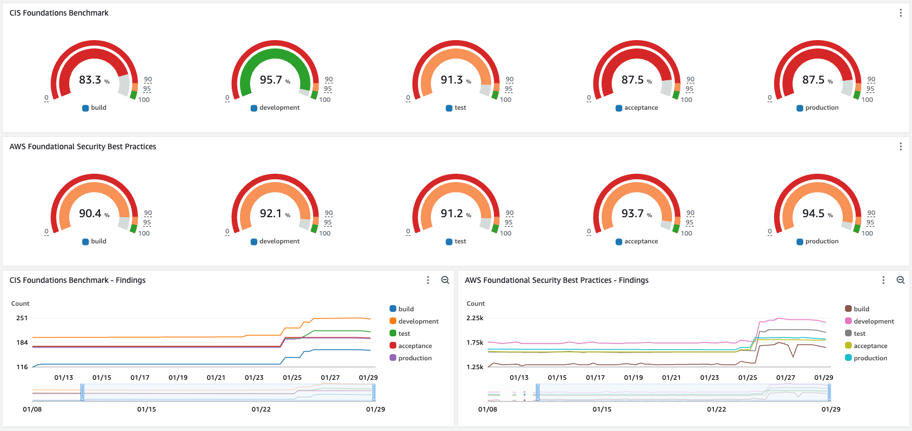

# AWS Security Posture - Solution

[AWS Security Posture](http://github.com/conijnio/aws-security-posture) collects security hub findings on a configurable interval, and extracts meaningful metrics. These metrics are stored in CloudWatch Metrics and can be visualized using CloudWatch DashBoards.



This solution was designed to be hosted in the account where you have your Security Hub aggregation configured. This way
you do not need to deploy it in every account individually. It also ensures that all accounts do get a security score.
When there are findings a score is being calculated.

You will be able to create dashboards like you see here.  The sample above has been created using [`compliance-dashboard.yaml`](./compliance-dashboard.yaml).
It assumes that you will have 5 AWS accounts per workload: `build`, `development`, `test`, `acceptance` and `production`.
You can easily change this to your own setup.

## Implementation


1. Use the given filter to retrieve all findings, we are fetching 100 findings per invocation.
2. When there is a `NextToken` we need to collect the rest of the findings.
3. Check if the fetched findings need to be aggregated. (repeat this until we have all findings)
4. Split the findings per AWS Account ID.
5. In parallel, we will now:
   1. Fetch the account name and extract the workload name and environment.
   2. Calculate the score based on the findings.
6. Publish the results to CloudWatch metrics.

## Filters

The state machine accepts a filter, the format of this filter is the [SecurityHub filter](https://docs.aws.amazon.com/securityhub/1.0/APIReference/API_AwsSecurityFindingFilters.html)
itself. So to get all `CIS AWS Foundations benchmark` findings you can use the following filter:

```yaml
Bucket: !Ref FindingsBucket
Report: cis-aws-foundations-benchmark-v1.2.0
SubscriptionArn: !Sub arn:aws:securityhub:${AWS::Region}:${AWS::AccountId}:subscription/cis-aws-foundations-benchmark/v/1.2.0
Filter:
   GeneratorId:
     - Comparison: PREFIX
       Value: arn:aws:securityhub:::ruleset/cis-aws-foundations-benchmark/v/1.2.0
   RecordState:
      - Comparison: EQUALS
        Value: ACTIVE
   WorkflowStatus:
      - Comparison: EQUALS
        Value: NEW
      - Comparison: EQUALS
        Value: NOTIFIED
```

By default, the following generators are used to generate the compliance scores:

- `arn:aws:securityhub:::ruleset/cis-aws-foundations-benchmark/v/1.2.0`
- `aws-foundational-security-best-practices/v/1.0.0`

### Using conformance packs

You can also generate compliance scores based on a conformance pack. You need to supply the conformance pack name.
And you need to use a common prefix in all of your config rules.

```yaml
Bucket: !Ref FindingsBucket
Report: lz-standard
ConformancePack: !Ref ConformancePack
Filter:
  Title:
    - Comparison: PREFIX
      Value: lz-
  RecordState:
    - Comparison: EQUALS
      Value: ACTIVE
  WorkflowStatus:
    - Comparison: EQUALS
      Value: NEW
    - Comparison: EQUALS
      Value: NOTIFIED
```

The name of the conformance pack is used to query all rules in the pack. SecurityHub will only display failed config rules.
We need to total number of controls to calculate the actual compliance score.

### Using custom rules

You can also generate compliance scores based on a custom rules. You need to supply the list of rules that are part of your report.
And you need to use a common prefix in all of your config rules.

```yaml
Bucket: !Ref FindingsBucket
Report: lz-standard
CustomRules:
   - lz-my-rule-1
   - lz-my-rule-2
   - lz-my-rule-3
   - lz-my-rule-4
Filter:
  Title:
    - Comparison: PREFIX
      Value: lz-
  RecordState:
    - Comparison: EQUALS
      Value: ACTIVE
  WorkflowStatus:
    - Comparison: EQUALS
      Value: NEW
    - Comparison: EQUALS
      Value: NOTIFIED
```

The name of the conformance pack is used to query all rules in the pack. SecurityHub will only display failed config rules.
We need to total number of controls to calculate the actual compliance score.

## Getting started

This solution uses [SAM (AWS Serverless Application Model)](https://aws.amazon.com/serverless/sam/) to deploy the resources.
One of the reasons to choice SAM is that it comes with an easy way to build and package AWS Lambda functions.

You can use the supplied `buildspec.yml` to build the solution via [AWS CodePipeline](https://docs.aws.amazon.com/codepipeline/latest/userguide/welcome.html) & [AWS CodeBuild](https://docs.aws.amazon.com/codebuild/latest/userguide/welcome.html). Afterward, you can deploy the solution using the generated `packaged-template.yaml` and `configuration.json` using [AWS CloudFormation](https://docs.aws.amazon.com/AWSCloudFormation/latest/UserGuide/Welcome.html) in the same pipeline.

Building and deploying the solution:

```shell
# Builds the solution
make build

# Deploys the solution
make deploy
```

## Running golang environment locally

You can run this project in a local container with the following command:

```shell
docker run --rm -it -v $(pwd):/go/aws-security-posture public.ecr.aws/docker/library/golang:latest
cd /go/aws-security-posture
```
