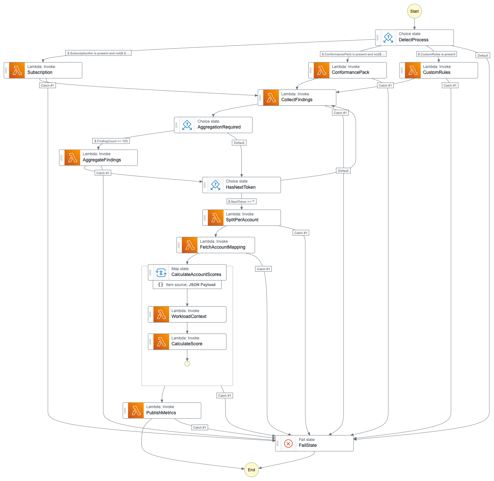

# AWS Security Posture - Solution

[AWS Security Posture](http://github.com/conijnio/aws-security-posture) collects security hub findings on a configurable interval, and extracts meaningful metrics. These metrics are stored in CloudWatch Metrics and can be visualized using CloudWatch DashBoards.



## Flow

- Collect all the findings for the given generator.
- Collect all accounts based on the findings.
- Calculate the compliance score for each account based on the account findings.
- Publish the score as CloudWatch Metrics.

## Supported Generators

By default, the following generators are used to generate the compliance scores: 

- `arn:aws:securityhub:::ruleset/cis-aws-foundations-benchmark`
- `aws-foundational-security-best-practices`

## Getting started

This solution uses [SAM (AWS Serverless Application Model)](https://aws.amazon.com/serverless/sam/) to deploy the resources.
One of the reasons to choice SAM is that it comes with an easy way to build and package AWS Lambda functions.

You can use the supplied `buildspec.yml` to build the solution via [AWS CodePipeline](https://docs.aws.amazon.com/codepipeline/latest/userguide/welcome.html) & [AWS CodeBuild](https://docs.aws.amazon.com/codebuild/latest/userguide/welcome.html). Afterward, you can deploy the solution using the generated `packaged-template.yaml` and `configuration.json` using [AWS CloudFormation](https://docs.aws.amazon.com/AWSCloudFormation/latest/UserGuide/Welcome.html) in the same pipeline.

Building and deploying the solution:

```shell
# Builds the solution
make build

# Deploys the solution 
make deploy
```
